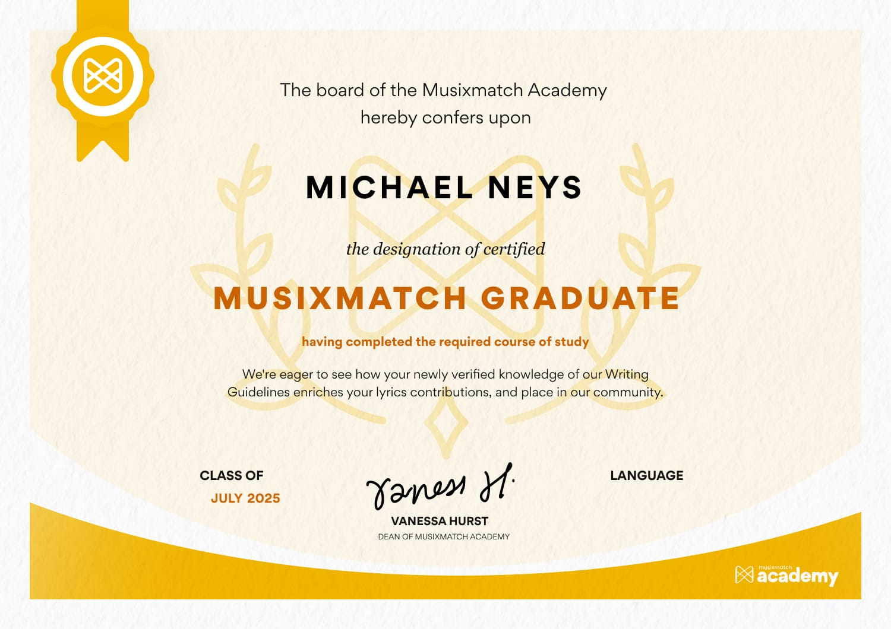

## 👋 Hi there, I'm Michael Neys

- 🌱 I’m currently studying [computer science](https://wikipedia.org/wiki/Computer_science) at [Hasselt University](https://www.uhasselt.be/)
  - 💼 Find more work on my university account: [University GitHub Account](https://github.com/MichaelN-2467626)
- 📫 Reach me at: info@neys.be
- ⚡ Hobbies:
    - 🖥️ Homelabbing
    - 📸 [Photography](https://www.instagram.com/michaelneys.photography/)

## 🛠️ Languages & Tools

    
    
    
    
    
    
    
    
    
    
    
    
    
    
    

## 📊 GitHub Stats

## 🎓 Certificates

<a href="https://www.musixmatch.com/"/>Musixmatch</a>

  

